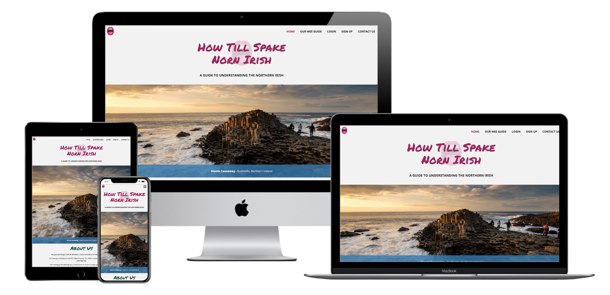
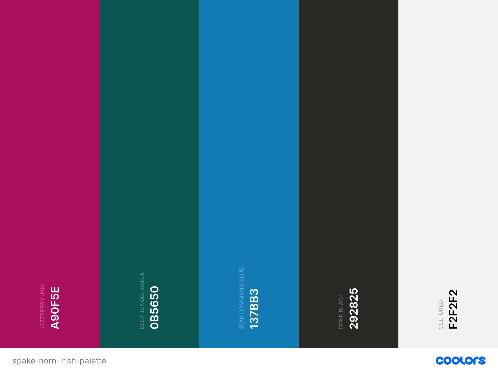

# How Till Spake Norn Irish

How Till Spake Norn Irish (How to Speak Northern Irish) is an online guide to all the words and phrases you're likely to hear when visiting Northern Ireland.



The image above is a screenshot of the site displayed on different devices using [Multi Device Website Mockup Generator](https://techsini.com/multi-mockup/).

A demo of the website can be found here: [www.howtillspakenornirish.com](https://how-till-spake-norn-irish.herokuapp.com/)

## Contents

- [**User Experience (UX)**](<#user-experience-(ux)>)
  - Project Goals
  - User Stories
    - First Time Visitor Goals
    - Registered User Goals
    - Site Owner Goals
  - Design
    - Colour Scheme
    - Typography
    - Imagery
  - Wireframes
  
- [**Database Schema**](#database-schema)

- [**Features**](#features)
  - Features that have been implemented
  - Features left to be implemented

- [**Branches**](#branches)

- [**Technologies Used**](#technologies-used)
  - Languages Used
  - Frameworks, Libraries and Programs Used
  - Dependencies

- [**Testing**](#testing)

- [**Deployment**](#deployment)
  - GitHub
  - Heroku
  - Cloning the Repository

- [**Credits**](#credits)
  - Code
  - Content
  - Media
  - Acknowledgements

---

## User Experience (UX)

### Project Goals

The goal of this project is to create an online dictionary of the different words and phrases used in Northern Ireland. Each word or phrase in the dictionary will have a definition along with an example of how the word or phrase might typically be used in conversation by locals.

The site is aimed at:

- Anyone visiting Northern Ireland for the first time
- Anyone who has visited but struggled to understand some of the words and phrases used by locals
- Anyone who has visited and was lucky enough to learn some of the words and phrases used by locals during their visit, and wants to share this with other tourists
- Anyone from Northern Ireland who wants to share some of the words and phrases they use to help tourists

Visitors to the site will be able to sign up for an account so they can easily add any words or phrases to the dictionary that might be missing.

### User Stories

#### First Time Visitor Goals

- As a **first time visitor**, I want to understand the main purpose of the site
- As a **first time visitor**, I want to be able to easily navigate through the site
- As a **first time visitor**, I want to be able to find out which common words and phrases are used by locals in Northern Ireland
- As a **first time visitor**, I want to be able to sign up for an account to add my own suggestions
- As a **first time visitor**, I want to be able to contact the site owner

#### Registered User Goals

- As a **registered user**, I want to be able to easily login and logout of my account
- As a **registered user**, I want to be able to add words or phrases to the dictionary
- As a **registered user**, I want to be able to edit any words or phrases I've added to the dictionary
- As a **registered user**, I want to be able to delete any words or phrases I've added to the dictionary

#### Site Owner Goals

- As a **site owner**, I want to provide the user with information about the purpose of the site
- As a **site owner**, I want to include a navigation bar to allow users to easily navigate to other pages on the site
- As a **site owner**, I want to provide the user with access to the dictionary without having to create an account
- As a **site owner**, I want to allow the user to easily sign up for an account to allow them to add their own suggestions to the dictionary
- As a **site owner**, I want to allow the user to easily edit and delete any words or phrases they've added to the dictionary
- As a **site owner**, I want all visitors and registered users to be able to easily contact me through email or social media platforms

### Design

The overall design of this project is based on the design of various Northern Ireland tourism sites. I based the design on these sites to keep with the tourism theme as this site is mainly aimed at tourists.

The site features a simple and easy to follow layout with a navigation bar at the top, the main content in the middle and a footer containing external links at the bottom.

#### Colour Scheme


_Colour palette generated using [coolors.co](https://coolors.co)_

The colour scheme of this project is based on both the [Discover Northern Ireland](https://discovernorthernireland.com/) website and the [Visit Belfast](https://visitbelfast.com) website. Both of these websites feature a white background with the colours blue, green and pink being used for headings and buttons on the site.

-  `#A90F5E`:
  - Used for the background colour of the footer section, all page headings and all buttons

-  `#0B5650`:
  - Used for the background colour of all flash messages, the sub-heading on the home page and all button hover states

-  `#137BB3`:
  - Used for the background colour of all the image descriptions and icon prefixes on forms

-  `#292825`:
  - Used for the main font colour throughout the site and all link hover states in the footer

-  `#F2F2F2`:
  - Used as the main background colour of the site and for all button text

#### Typography

Throughout the site, I used two different fonts from Google Fonts. These were [Permanent Marker](https://fonts.google.com/specimen/Permanent+Marker?query=perman&preview.text_type=custom) with the suggested pairing of [Open Sans](https://fonts.google.com/specimen/Open+Sans?preview.text_type=custom&query=open+sans).

I chose the Permanent Marker font as this was this font was similar to the font used for headings on the [Discover Northern Ireland](https://discovernorthernireland.com/) website and I wanted to keep the design similar to this site to keep with the tourism site theme. This font was used on all headings throughout the site.

I then paired this with the suggested font of Open Sans to use as the main font throughout the site, as this is an easy to read font.

#### Imagery

The images featured on this site are of popular landmarks and visitor attractions within Northern Ireland. These images are from various different Northern Ireland tourism sites. Links to these sites can be found in the [credits](#credits) section at the end of this document. These images have been used as background images for the main content section on each page. Each page/section features a different image. I've also used an open mouth vector icon for the site logo and favicon.

#### Wireframes

The wireframes for my site were created using [Balsamiq](https://balsamiq.com/). I created wireframes for mobile, tablet and desktop devices.

The final design of this project is slightly different to the design of the wireframes. As I started coding the project and looking at Northern Ireland tourism sites, I decided to base the design of this project on those sites instead. This has resulted in some changes to the layout of some pages.

Rather than having a single form displayed in the centre of the page for the sign up, login and add/edit word forms, I decided to keep the design of the site more consistent and split each page into different sections. This layout consists of a header, the main content and a footer, and is used across the site. I've also added an additional error page for an internal server error (500) which I didn't create a wireframe for. The design of this page is similar to the 404 error page included in the wireframes. The final design of the dictionary layout has also changed from a card based layout to a collapsible list which I've explained in the branches section in [TESTING.md](TESTING.md).

Links to the wireframes can be found below. Each link contains the wireframes for mobile, tablet and desktop devices:

- [Site Map](https://github.com/KirstChat/how-till-spake-norn-irish/blob/master/wireframes/site-map.pdf)
- [Home](https://github.com/KirstChat/how-till-spake-norn-irish/blob/master/wireframes/home.pdf)
- [Dictionary](https://github.com/KirstChat/how-till-spake-norn-irish/blob/master/wireframes/dictionary.pdf)
- [Login](https://github.com/KirstChat/how-till-spake-norn-irish/blob/master/wireframes/login.pdf)
- [Profile](https://github.com/KirstChat/how-till-spake-norn-irish/blob/master/wireframes/profile.pdf)
- [Add/Edit Word](https://github.com/KirstChat/how-till-spake-norn-irish/blob/master/wireframes/add-edit-word.pdf)
- [Sign Up](https://github.com/KirstChat/how-till-spake-norn-irish/blob/master/wireframes/sign-up.pdf)
- [Contact](https://github.com/KirstChat/how-till-spake-norn-irish/blob/master/wireframes/contact-us.pdf)
- [404](https://github.com/KirstChat/how-till-spake-norn-irish/blob/master/wireframes/404.pdf)

[Contents](#contents)

---

## Database Schema

MongoDB Atlas was the cloud database service used to create and store the database collections for this project:

### Dictionary Collection

| Key | Value |
| :---: | :---: |
| _id: | ObjectId("unique_id") |
| word: | "string" |
| definition: | "string" |
| example: | "string" |
| added_by: | "string" |

### User Profile Collection

| Key | Value |
| :---: | :---: |
| _id: | ObjectId("unique_id") |
| first_name: | "string" |
| username: | "string" |
| password: | "string" |

[Contents](#contents)

---

## Features

### Features that have been implemented

- Responsive on all devices with a mobile-first design using the Materialize framework

- An easy to use navigation bar located at the top of every page with a collapsible side navigation menu on mobile devices

- A home page with an about section that explains the purpose of the site

- A dictionary page with a materialize collapsible component, search functionality and a sort button

- Add, Edit and Delete word functionality

- Login, Log Out and Sign Up functionality

- A profile page that displays words the user has added to the dictionary

- A contact page with an easy to use form connected to EmailJS to allow anyone to contact the site owner

- A footer located on every page with links to social media accounts, an email link and various different Northern Ireland tourism websites

- A custom 404 error page and 500 error page

### Features left to be implemented

In future releases of this project and I progress as a developer, I would like to add some additional features to improve user experience:

- Rating/Voting System
  - This feature would allow users to rate the words within the dictionary either through a star based rating system or an up-vote/down-vote based system
  - This type of feature will let visitors and other users know how accurate a word or word description is within the dictionary

- Favourites Section
  - This feature would allow users to add any of the words in the dictionary to a favourites section that would be located in their profile
  - This would allow users to easily view some of their favourite words without having to search or scroll through the dictionary

- Pronunciation Feature
  - This feature would allow users to hear how each of the words featured in the dictionary are pronounced
  - When a user clicks on a word to view the definition and example, they will also be presented with an audio button to hear the pronunciation of that word
  - When a user is adding a word to the dictionary, they will have the option to upload an audio file of the word pronunciation

[Contents](#contents)

---

## Technologies Used

### Languages

- [HTML](https://developer.mozilla.org/en-US/docs/Web/HTML)
- [CSS](https://developer.mozilla.org/en-US/docs/Web/CSS)
- [JavaScript](https://developer.mozilla.org/en-US/docs/Web/JavaScript)
- [Python](https://www.python.org/)

### Frameworks, Libraries and Programs

- [Balsamiq](https://balsamiq.com/)
  - Balsamiq was used to create the wireframes for desktop, tablet and mobile during the design process
- [EmailJS](https://www.emailjs.com/)
  - EmailJS was used to add an email service to the form in the contact template
- [Flask](https://flask.palletsprojects.com/en/1.1.x/)
  - Flask was the microframework use to build the application
- [Font Awesome](https://fontawesome.com/)
  - Font Awesome was used to add various icons throughout the site
- [Google Fonts](https://fonts.google.com/)
  - Google Fonts was used to add the Permanent Marker and Open Sans fonts to the site
- [Git](https://git-scm.com/)
  - Git was used for version control by utilising the terminal in VS Code to commit to Git and push to GitHub. Git was also used to create branches to test new features before merging with the master branch
- [GitHub](https://github.com/)
  - GitHub was used to store the project code that was pushed from VS Code
- [Heroku](https://www.heroku.com/)
  - Heroku is a cloud platform that was used to deploy and run the application from the GitHub repository
- [jQuery](https://jquery.com/)
  - jQuery is the JavaScript library that was used to activate Materialize components and to add additional password validation to forms
- [Materialize](https://materializecss.com/)
  - Materialize is a modern responsive CSS framework that was used to give the website a simple, responsive layout
  - Also used to add different components including a navigation bar, a collapsible accordion and form elements
- [MongoDB](https://www.mongodb.com/)
  - MongoDB Atlas is a cloud database service used to create and store the database collections for the application
- [VS Code](https://code.visualstudio.com/)
  - Visual Studio Code was the IDE used to code the project

### Dependencies

- [autopep8](https://pypi.org/project/autopep8/)
  - A tool that automatically formats Python code to conform to the PEP 8 style guide
- [click](https://palletsprojects.com/p/click/)
  - Composable command line interface toolkit
- [dnspython](https://www.dnspython.org/)
  - A DNS toolkit for Python
- [Flask-PyMongo](https://flask-pymongo.readthedocs.io/en/latest/)
  - PyMongo support for Flask applications
- [itsdangerous](https://palletsprojects.com/p/itsdangerous/)
  - Various helpers to pass data to untrusted environments and back
- [Jinja2](https://palletsprojects.com/p/jinja/)
  - Templating language for Python
- [MarkupSafe](https://palletsprojects.com/p/markupsafe/)
  - Safely add untrusted strings to HTML/XML markup
- [pymongo](https://pypi.org/project/pymongo/)
  - Python driver for MongoDB
- [Werkzeug](https://werkzeug.palletsprojects.com/en/1.0.x/)
  - A comprehensive WSGI web applications library

[Contents](#contents)

---

## Testing

Further Testing information can be found in a separate document: [TESTING.md](TESTING.md)

[Contents](#contents)

## Deployment

### GitHub

This project was coded in VS Code and pushed to GitHub using the following steps:

- Create a new folder in your preferred area in your local drive
- Open the folder in VS Code and create a README.md file
- Open source control in VS Code and select **"Publish to GitHub"**
- If prompted, sign into GitHub to connect your account to VS Code if you haven't done so already
- In source control, select **"Publish to GitHub"**
- Give your repository a name and select **"Publish to GitHub Public Repository"**
- After the repository is successfully published to GitHub, you can use git bash to add, commit and push any changes to the GitHub repository
- To stage a file to commit, use ```git add``` and the name of the file you want to commit
- After adding a file to commit, use ```git commit -m "add commit message"``` to specify what changes you have made to that file
- After committing a file, use ```git push``` to push all staged changes to the GitHub repository
- Before installing any additional packages, create a virtual environment - this will ensure that packages installed are only installed in the virtual environment folder: ```python3 -m venv venv```
- Ensure that the interpreter path at the bottom left of the IDE window is the virtual environment you created: ```Python 3.7.4 64-bit('venv': venv)```
- Create a **env.py** file to store environment variables: IP, PORT, SECRET_KEY, MONGO_URI, MONGO_DBNAME
- Add the **env.py** file and the virtual environment folder to a **.gitignore** file to ensure this information isn't pushed to the repository

### Heroku

This project is hosted on Heroku - A cloud platform service that enables developers to build, run and operate applications entirely in the cloud:

- Before creating a Heroku app, open the repository in VS Code and create a requirements file that lists all the applications and dependencies required to run the application: ```pip3 freeze --local > requirements.txt```
- Create a Heroku specific file called a Procfile - this is what Heroku looks for to know which file runs the app and how to run it: ```echo web: python run.py > Procfile```
- Open [Heroku](www.heroku.com) and login to your account or sign up for an account if you don't already have one
- Open the dashboard and select **"New"** to create a new app
- Name the app and set the region to Europe
- Open the settings tab and open **"Reveal Config Vars"**
- Add the environment variables from the **env.py** file:
  - **KEY:** IP | **VALUE:** 0.0.0.0
  - **KEY:** PORT | **VALUE:** 5000
  - **KEY:** SECRET_KEY | **VALUE:** YOUR_SECRET_KEY
  - **KEY:** MONGO_URI | **VALUE:** YOUR_MONGO_URI
  - **KEY:** MONGO_DBNAME | **VALUE:** YOUR_MONGO_DBNAME
- To deploy the app from GitHub, open the deploy tab and change the deployment method to GitHub
- Connect to your GitHub account and search for the name of the repository to connect to
- Once connected, **"Enable Automatic Deployments"** and select the **"Master"** or **"Main"** branch to deploy
- Click the **"Deploy Branch"** button to deploy the app to Heroku

### Cloning the Repository

To clone the repository and make a local copy on your computer, follow these steps:

- Open GitHub and locate the GitHub repository: [https://github.com/KirstChat/how-till-spake-norn-irish](https://github.com/KirstChat/how-till-spake-norn-irish)
- Under the repository name, click "Code" and copy the link to clone the repository using "HTTPS"
- After copying the link, open terminal on your computer - this step can also be done in the terminal in your preferred IDE
- Change the current working directory to the location where you want the cloned directory to be saved
- Type ```git clone```, and then paste the URL: [https://github.com/KirstChat/how-till-spake-norn-irish.git](https://github.com/KirstChat/how-till-spake-norn-irish.git)
- Press Enter to create a local clone
- To then run the repository locally, install the required dependencies from the **requirements.txt** file: ```pip3 install requirements.txt```
- Run the app from your local IDE using the following command: ```python3 app.py```

[Contents](#contents)

---

## Credits

### Code

- [Vs Code Virtual Environment on Mac OS](https://www.youtube.com/watch?v=06I63_p-2A4&t=1571s)
  - This video by Corey Schafer helped with setting up a virtual environment in VS Code on Mac as this is currently my preferred IDE

- [Flash Message Categories](https://www.youtube.com/watch?v=lcVdZtVvnnk)
  - This video by Pretty Printed helped with displaying flash messages on relevant pages within the main content by adding categories

- [Image Text Block](https://www.w3schools.com/howto/howto_css_image_text_blocks.asp)
  - This code was used to add image descriptions to each of the sections containing a background image of landmarks/visitor attractions in Northern Ireland

- [Jinja Active Classes](https://stackoverflow.com/questions/55895502/dynamically-setting-active-class-with-flask-and-jinja2/55895621#55895621)
  - This code was used to help add active classes to the navigation bar to show the user which page they are currently viewing

- [Python sort() function](https://www.w3schools.com/python/python_mongodb_sort.asp)
  - This function was used to sort the MongoDB dictionary collection in ascending and descending order for the Sort By button in the dictionary.html template

- [Custom 404 Error Page](https://flask.palletsprojects.com/en/1.1.x/patterns/errorpages/)
  - The Flask documentation was used to help add a custom 404 error page within the Flask app

- [Password Regex](https://www.html5pattern.com/Passwords)
  - The password regex used in the forms featured on the login.html and sign_up.html templates was taken from this site

- [Python count() function](https://www.w3schools.com/python/ref_list_count.asp)
  - This function was used to check if zero entries were returned by the search function in the dictionary.html template

- [Markdown Colour Flag](https://stackoverflow.com/questions/11509830/how-to-add-color-to-githubs-readme-md-file)
  - This was used to add colour flags to the design section of this README.md file

### Content

Most of the content on this site was written by the developer, with some guidance from the following sites on how to define some of the Northern Irish words:

- [16 Slang Phrases You'll Need to Know in Northern Ireland](https://matadornetwork.com/life/16-slang-phrases-youll-need-know-northern-ireland/)
- [Top 20 Mad Northern Irish Phrases That Only Make Sense to Locals](https://www.irelandbeforeyoudie.com/20-mad-northern-irish-phrases-that-only-make-sense-to-locals-2/)

As a Northern Irish, I already knew most of the words so trying to explain what they all meant was a challenge!

### Media

#### Images

As this project is for educational purposes, images have been used from a variety of sites as it was difficult to find the required images on free image sites. Links to these resources can be found below:

- Belfast City Hall Image from [Visit Belfast](https://visitbelfast.com/partners/belfast-city-hall/)
- Carrick-A-Rede Image from [Discover Northern Ireland](https://discovernorthernireland.com/things-to-do/carrick-a-rede-rope-bridge-p675071)
- Dark Hedges Image from [Pixabay](https://pixabay.com/photos/avenue-trees-the-dark-hedges-3464777/)
- Dunluce Castle Image from [Discover Northern Ireland](https://discovernorthernireland.com/things-to-do/dunluce-castle-medieval-irish-castle-on-the-antrim-coast-p675011)
- Giants Causeway Image from [Visit Belfast](https://visitbelfast.com/partners/giants-causeway/#&gid=1&pid=6)
- Mussenden Temple Image from [Discover Northern Ireland](https://discovernorthernireland.com/things-to-do/mussenden-temple-and-downhill-demesne-p675701)
- Peace Bridge Image from [Discover Northern Ireland](https://discovernorthernireland.com/things-to-do/peace-bridge-p701951)
- Titanic Museum Belfast Image from [Visit Belfast](https://visitbelfast.com/partners/titanic-belfast/)

The vector image used for the site logo and the favicon can be found below:

- Open Mouth Vector Icon from [Flat Icon](https://www.flaticon.com/authors/smashicons)

All images used on this site were optimized for web using [TinyJPG](https://tinyjpg.com/)

### Acknowledgements

- Thanks to my mentor Spencer Barriball for all his advice and feedback throughout this project - you've been awesome as always and your knowledge of Northern Irish slang is just as good as mine!

- A huge thank you to Igor in Tutor Support for helping me spot an error in my code that wouldn't let me render the edit word functionality - It's always the silly things that catch me out!

- And thanks as always to the Code Institute Slack community for being an incredible bunch of people! Especially Ed B who helped someone in a thread in #data-centric-dev that was having similar issues with a delete confirmation modal deleting the first word in the collection rather than the targeted word - that was a huge help after what felt like hours of searching for a solution!

[Contents](#contents)
