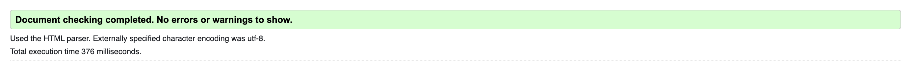
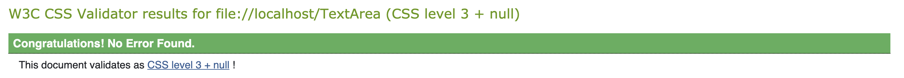
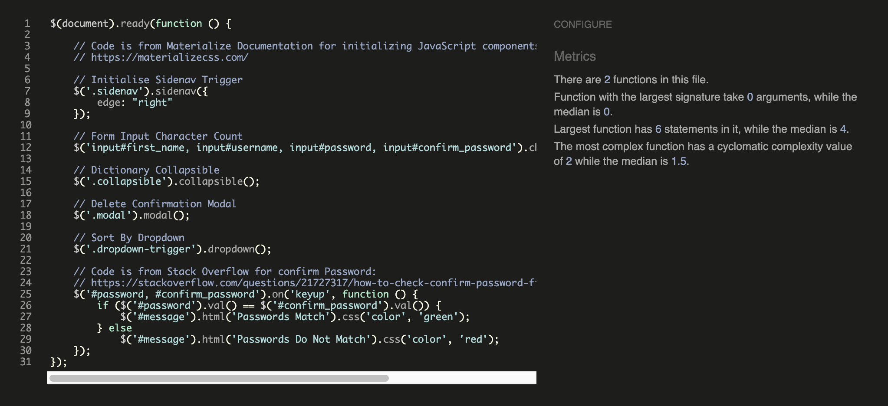
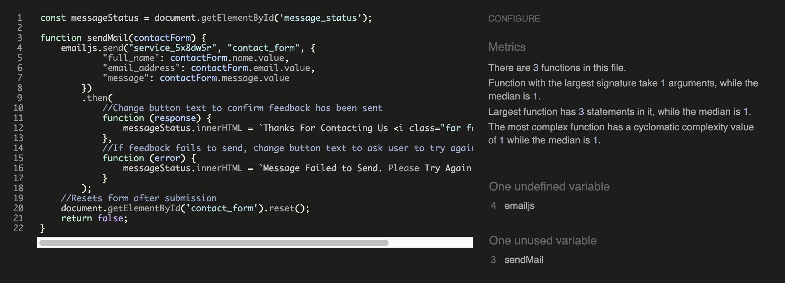
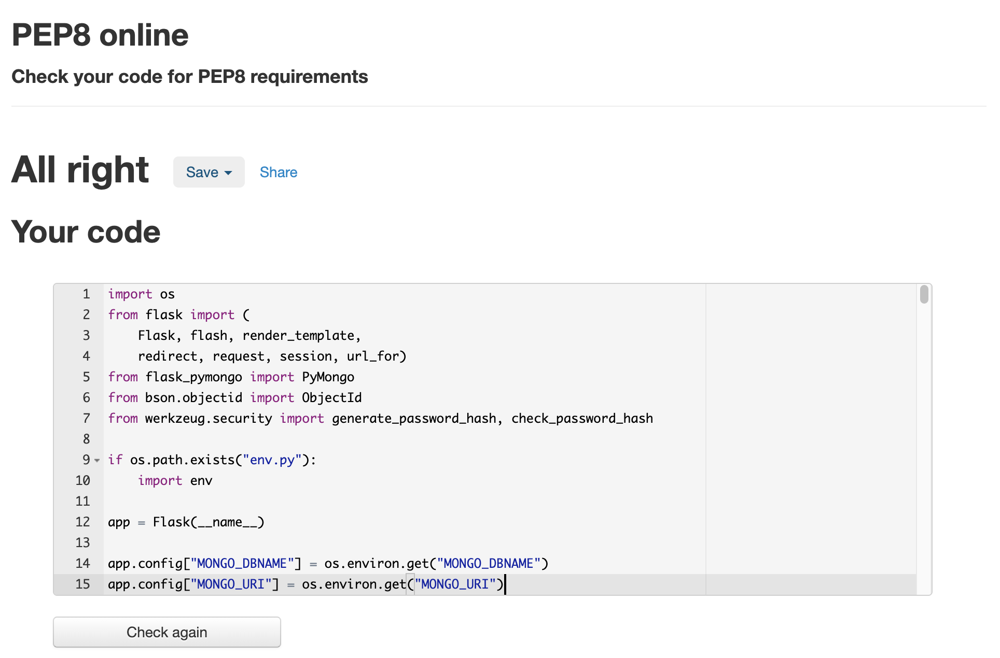
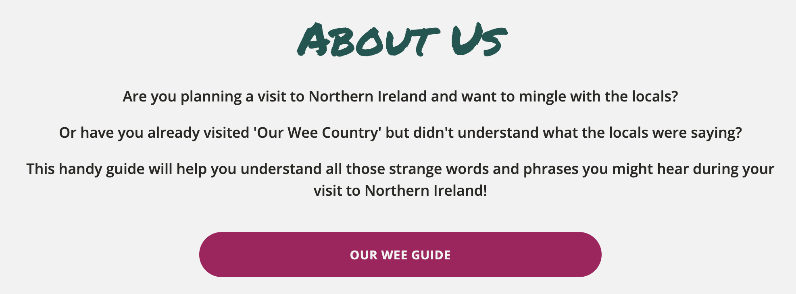

# Testing for How Till Spake Norn Irish

## Code Validators

The W3C Markup Validator and the W3C CSS Validator were used to validate the HTML and CSS files in the project and to check there were no syntax errors. The following shows the results for each page:

[W3C Markup Validator](https://validator.w3.org/)

- An error across all pages for lack of heading in section element
  - Replaced all section elements with div elements instead
- contact.html displayed a warning for unnecessary use of the type attribute in JavaScript resources
  - Removed the type attribute from the script tag
- add_word.html and edit_word.html displayed a warning for the use of type attribute on a textarea element
  - Removed the type attribute from all textarea elements
- dictionary.html and profile.html displayed a warning for the use of a div element within a ul element
  - Replaced the div element of the delete modal with an li element

After fixing the errors and warnings, I ran all pages through the validator again to check there were no other errors or warnings to show:

[W3C CSS Validator](https://jigsaw.w3.org/css-validator/)

- Initially passed style.css through an autoprefixer but this displayed multiple errors when ran through the validator
  - Fixed by removing prefix vendors from CSS code
  
After fixing the errors above, I ran the CSS code through the validator again to check there were no other errors. There were warnings for the use of colour variables, which can be ignored:

[JS Hint](https://jshint.com/) was used to check that the JavaScript code in the project complies with coding rules and to check for any syntax errors:

- No errors found in script.js

- Found one undefined and one unused variable in contact.js

[PEP8 Online](http://pep8online.com/) was used to check that the Python code meets PEP8 requirements:

- Errors displaying for lines being too long on flash messages and comments
  - Displayed flash messages and comments across multiple lines where required

After fixing the errors above, I ran the code through PEP8 online again to check that there were no other errors:
  

## Testing User Stories

### First Time Visitor Goals

- As a **first time visitor**, I want to understand the main purpose of the site:
  - I've added an about section to the home page that explains the purpose of the site

- As a **first time visitor**, I want to be able to easily navigate through the site:
  - I've added a navigation bar at the top of all pages to provide links to all other pages on the site
  - I've also added external links in the footer to social media platforms and various Northern Ireland tourism sites, as well as a link to the contact form on the site

- As a **first time visitor**, I want to be able to find out which common words and phrases are used by locals in Northern Ireland:
  - I've created a dictionary page titled 'Our Wee Guide' which contains a collapsible list of all the words and phrases that have been added to the site so far
  - When a visitor clicks on a word in the list, the word will pop out with a definition of that word and an example of it being used in conversation

- As a **first time visitor**, I want to be able to sign up for an account to add my own suggestions:
  - I've added a page with a sign up form to the site to allow visitors to create an account
  - After creating an account, the user will then have the option to add a word to the dictionary

- As a **first time visitor**, I want to be able to contact the site owner

### Registered User Goals

- As a **registered user**, I want to be able to easily login and logout of my account
- As a **registered user**, I want to be able to add words or phrases to the dictionary
- As a **registered user**, I want to be able to edit any words or phrases I've added to the dictionary
- As a **registered user**, I want to be able to delete any words or phrases I've added to the dictionary

## Responsiveness

## Performance

## Manual Testing
