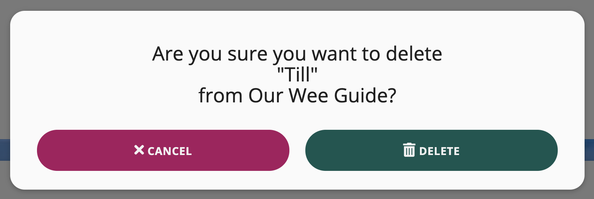

# Testing for How Till Spake Norn Irish

## Contents

- [Code Validation](#code-validation)
- [User Stories](#user-stories)
- [Branches](#branches)
- [Responsiveness](#responsiveness)
- [Performance](#performance)
- [Manual Testing](#manual-testing)
- [Known Bugs](#known-bugs)

---

## Code Validation

The W3C Markup Validator and the W3C CSS Validator were used to validate the HTML and CSS files in the project and to check there were no syntax errors. The following shows the results for each page:

[W3C Markup Validator](https://validator.w3.org/)

- An error across all pages for lack of heading in section element
  - Replaced all section elements with div elements instead
- contact.html displayed a warning for unnecessary use of the type attribute in JavaScript resources
  - Removed the type attribute from the script tag
- add_word.html and edit_word.html displayed a warning for the use of type attribute on a textarea element
  - Removed the type attribute from all textarea elements
- dictionary.html and profile.html displayed a warning for the use of a div element within a ul element
  - Replaced the div element of the delete modal with an li element

After fixing the errors and warnings, I ran all pages through the validator again to check there were no other errors or warnings to show:

[W3C CSS Validator](https://jigsaw.w3.org/css-validator/)

- Initially passed style.css through an autoprefixer but this displayed multiple errors when ran through the validator
  - Fixed by removing prefix vendors from CSS code
  
After fixing the errors above, I ran the CSS code through the validator again to check there were no other errors. There were warnings for the use of colour variables, which can be ignored:

[JS Hint](https://jshint.com/) was used to check that the JavaScript code in the project complies with coding rules and to check for any syntax errors:

- No errors found in script.js

- Found one undefined and one unused variable in contact.js

[PEP8 Online](http://pep8online.com/) was used to check that the Python code meets PEP8 requirements:

- Errors displaying for lines being too long on flash messages and comments
  - Displayed flash messages and comments across multiple lines where required

After fixing the errors above, I ran the code through PEP8 online again to check that there were no other errors:
  

[Contents](#contents)

---

## User Stories

### First Time Visitor Goals

As a **first time visitor**, I want to understand the main purpose of the site:

- I've added an about section to the home page that explains the purpose of the site which is to help visitors learn Northern Irish

_Home Page About Section_

As a **first time visitor**, I want to be able to easily navigate through the site:

- I've added a navigation bar at the top of all pages to provide links to all other pages on the site
- I've also included buttons throughout the site that also link to other pages on the site
- I've added external links in the footer to social media platforms and various Northern Ireland tourism sites, as well as an email link to contact the site owner

_Desktop Navigation Bar_

_Footer_

As a **first time visitor**, I want to be able to find out which common words and phrases are used by locals in Northern Ireland:

- I've created a dictionary titled 'Our Wee Guide' which contains a collapsible list of all the words and phrases that have been added to the site so far
- When a visitor clicks on a word in the list, the word will pop out with a definition of that word and an example of it being used in conversation

_Dictionary Word Example_

As a **first time visitor**, I want to be able to sign up for an account to add my own suggestions:

- I've added a page with a sign up form to the site to allow visitors to create an account
- After creating an account, the user will then have the option to add words to the dictionary

_Sign Up Form_

As a **first time visitor**, I want to be able to contact the site owner:

- I've included a contact us page on the site to allow the user to leave feedback about the overall site or ask any questions they might have
- I've also included links to social media pages in the footer as well as an email link which gives the user another way to contact the site owner if the contact form were to stop working

_Contact Form_

### Registered User Goals

As a **registered user**, I want to be able to easily login and logout of my account:

- I've included a login page to allow the user to sign into their account
- The user can easily logout of their account by clicking on the logout button in the navigation bar at the top of the page

_Login Form_

_Logout Function_

As a **registered user**, I want to be able to add words or phrases to the dictionary:

- When a user is logged into their account, they will have the option to add words to the dictionary
- The add word function is located on the user profile page, the home page and the dictionary page

_Add Word Function_

As a **registered user**, I want to be able to edit any words or phrases I've added to the dictionary:

- When a user is logged into their account, they will have the option to edit any of the words they have added to the dictionary
- The user can easily see which words they have added by going to their profile page

_Edit Word Button_

_Edit Word Function_

_User Profile Page_

As a **registered user**, I want to be able to delete any words or phrases I've added to the dictionary:

- When a used is logged into their account, they will have the option to delete any of the words they have added to the dictionary
- The user can easily see which words they have added by going to their profile page

_Delete Word Button_

_Delete Confirmation Modal_

[Contents](#contents)

---

## Branches

Throughout the development process, different branches have been created to test different features and layouts which have been merged with the master branch.

Dictionary Branch:

- This branch was created to test a different layout for the dictionary template
- I originally used a grid layout with each of the words in a materialize card container and when clicked, this displayed the word definition and example
- This layout caused overflow issues in some of the cards which meant that the cards couldn't have a fixed height
- To fix this issue, I tried using the materialize collapsible accordion feature instead to display the dictionary and this helped fix the sizing issues with the original card layout

Sort Branch:

- This branch was created to test a sort function that sorts the words in the dictionary alphabetically from A-Z or Z-A
- This was achieved by creating two new routes in app.py; one route for the ascending order and another route for the descending order
- I then added a Materialize dropdown button to the dictionary template and linked each option in the dropdown to the relevant route

[Contents](#contents)

---

## Responsiveness

As well as running each page through a validator and testing user stories to see if they were met, I also tested the responsiveness of the site across a number of different devices and browsers:

- Chrome DevTools was used during the development process to test the responsiveness of the site on different devices before pushing any changes to GitHub
- After pushing changes to GitHub, the site was also tested in Firefox and Safari
- The site was also tested across a number of personal devices including an iPad, iPhone 11 and MacBook Pro
- A desktop app called [Responsively](https://responsively.app/) was also used to check the responsiveness of the site on some additional android devices that I didn't have access to on Chrome DevTools

[Contents](#contents)

---

## Performance

As well as testing the responsiveness of the site, I also tested the performance of each page using [Lighthouse](https://developers.google.com/web/tools/lighthouse) in Chrome DevTools. After generating reports for both desktop and mobile, the site performed better on desktop. The CDN links used in the site brought down the overall performance score on both desktop and mobile, but these links are required for Google Fonts, Font Awesome and Materialize. The screenshots below show the average score across all pages on the site.

Desktop Performance:

Mobile Performance:

[Contents](#contents)

---

## Manual Testing

Each page has been tested individually to check that:

- Images load properly
- Navigation buttons link to the correct pages in the site
- External links located in the footer open in a new tab/window

Each of the forms featured on the site were also tested individually to check that:

- Form validation works
- Flash messages appear on appropriate pages when a user has:
  - Created an account
  - Logged in to their account
  - Logged out of their account
  - Successfully added a word to the dictionary
  - Successfully edited a word in the dictionary
  - Successfully deleted a word in the dictionary

The site has also been reviewed by some fellow Code Institute students on the peer-code-review channel on Slack. Following some feedback from another student (Marcin Kli), I changed the position and styling of the message status in the contact form to follow a similar style of the flash messages that appear throughout the site. This styling helps the message stand out more for the user.

[Contents](#contents)

---

## Known Bugs

There was a minor bug found on the site on completion of the project which has been listed below

Issue with form reset in contact.html:

- After clicking the submit button on the contact form, there is a small issue with the label positioning when the form being reset
- The screenshot below shows that the input labels appear over the top of the input fields
- When the input field is selected, the labels then return to their original position

 

[Contents](#contents)

---
